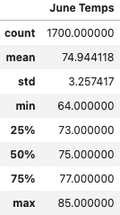

## Surfs_up

### Overview 
The purpose of this analysis was to investigate tempuratues in Hawaii during the month of June and December. For an ice cream and surf shop low temperatures may affect sales. This analysis will provide insight as to whether the business is sustainable year- round. 

### Results

    

### Summary
-
 
 June and December seem to have similar weather. June has an average temperature of 75 vs Decembers 73.09. Both also have a similar standard deviation of 3.25 vs 3.75. The minimum temperature in December was 59 degrees. We can expect sales to be lower on these day but overall the month of December and June should not the disqualify the ice cream and surf shop investment.
